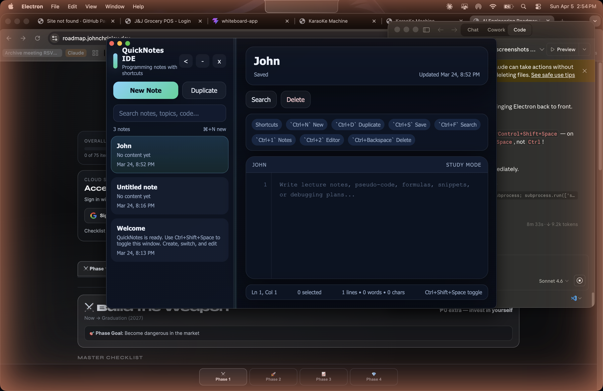

# QuickNotes


A lightweight, always-on-top desktop notepad built with Electron. Toggle it instantly from anywhere on your screen with a global keyboard shortcut — no clicking through windows, no distractions.

---

## Description

QuickNotes is a floating desktop notes app that stays out of your way until you need it. Press `Ctrl+Shift+Space` (or `Cmd+Shift+Space` on macOS) from any application and your notes panel appears instantly. Press it again to hide it. Notes are saved automatically — no manual saving required.

Built for developers, writers, and anyone who keeps a mental scratch pad open while working.

---

## Features

- **Global shortcut toggle** — `Ctrl+Shift+Space` / `Cmd+Shift+Space` summons or hides the window from anywhere
- **Always-on-top window** — floats above all other applications
- **Multi-note sidebar** — create, switch between, and delete multiple notes
- **Autosave** — notes persist automatically via JSON flat-file storage
- **Frameless dark UI** — clean, distraction-free interface with a dark theme
- **Single-instance lock** — only one QuickNotes process runs at a time; re-launching focuses the existing window
- **Custom window controls** — minimize and close buttons built into the UI
- **Cross-platform builds** — package as `.dmg` for macOS or `.exe` installer for Windows

---

## Tech Stack

| Technology | Version | Role |
|---|---|---|
| [Electron](https://electronjs.org) | ^36.0.0 | Desktop runtime |
| [electron-builder](https://electron.build) | ^26.8.1 | Packaging & distribution |
| HTML / CSS / JavaScript | — | Frontend UI |
| JSON (flat file) | — | Data persistence |
| Node.js `fs` module | — | File I/O |

---

## Installation

### Prerequisites

- [Node.js](https://nodejs.org) v18 or higher
- npm (included with Node.js)
- Git

### Steps

```bash
# 1. Clone the repository
git clone https://github.com/Aresss615/notepad-app.git
cd notepad-app

# 2. Install dependencies
npm install

# 3. Start the app in development mode
npm start
```

The app window will open. Press `Ctrl+Shift+Space` (Windows/Linux) or `Cmd+Shift+Space` (macOS) to toggle the window at any time.

---

## Usage

| Action | How |
|---|---|
| Toggle window | `Ctrl+Shift+Space` / `Cmd+Shift+Space` |
| Create a new note | Click **+** in the sidebar |
| Switch notes | Click any note title in the sidebar |
| Delete a note | Hover a note in the sidebar, click the trash icon |
| Autosave | Happens automatically while you type |
| Minimize | Click the minimize button in the top-right |
| Hide window | Click close button or use the shortcut again |

Notes are stored locally at `.quicknotes/user-data/quicknotes-data.json` relative to the app directory.

---

## Screenshots

### Main Window


### Multi-Note Sidebar


### Always-on-Top Behavior


> **Note:** Add a `screenshots/` folder to the repo root and place your images there to populate the above.

---

## Folder Structure

```
notepad-app/
├── main.js                  # Electron main process (window, shortcuts, IPC, file I/O)
├── preload.js               # Context bridge — exposes safe APIs to renderer
├── package.json             # Project config, scripts, build settings
├── package-lock.json        # Locked dependency tree
├── src/
│   ├── index.html           # App shell / renderer entry point
│   ├── renderer.js          # Frontend logic (notes CRUD, UI interactions)
│   └── styles.css           # Dark theme styles
├── .quicknotes/             # Runtime data (auto-generated, gitignored)
│   ├── user-data/
│   │   └── quicknotes-data.json   # Persisted notes
│   └── session-data/        # Electron session cache
└── release/                 # Build output (auto-generated by electron-builder)
```

---

## Building for Distribution

### macOS (.dmg)

```bash
npm run dist:mac
```

### Windows (.exe installer via NSIS)

```bash
npm run dist:win
```

Built artifacts are output to the `release/` directory. The Windows installer supports custom install directory, desktop shortcut, and Start Menu shortcut.

---

## Deployment

QuickNotes is a desktop application — there is no server to deploy. To distribute it:

1. Run the appropriate build command above
2. Share the output from `release/` — `.dmg` for macOS users, `.exe` for Windows users
3. On macOS, notarization via Apple Developer ID is recommended for public distribution

### Self-Hosted Distribution (Linux Server File Hosting)

```bash
# Serve the release directory over HTTP for easy download
cd release
python3 -m http.server 8080
```

---

## Future Improvements

- [ ] Rich text / Markdown formatting support
- [ ] Note tags and categories
- [ ] Search across all notes
- [ ] Cloud sync (optional, opt-in)
- [ ] Configurable global shortcut
- [ ] Linux AppImage build target
- [ ] Note export to `.txt` / `.md`
- [ ] Resizable sidebar

---

## Author

**John Chrisley**
- GitHub: [@Aresss615](https://github.com/Aresss615)
- Project: [notepad-app](https://github.com/Aresss615/notepad-app)

---

## License

This project is licensed under the [MIT License](./LICENSE).
